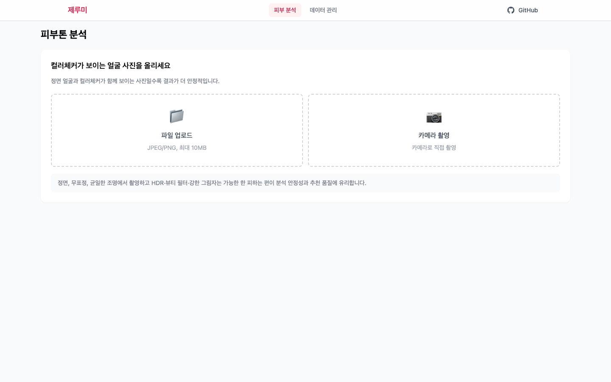
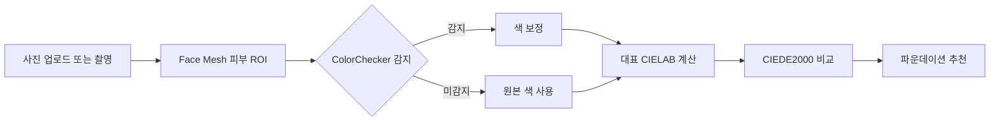

# 제루미 (Jerumi)

얼굴 사진의 대표 피부색을 분석하고 CIEDE2000 색차를 기준으로 가까운 파운데이션을 추천하는 웹 서비스입니다.

*A full-stack web service that analyzes representative facial skin color and recommends foundation shades using CIEDE2000 color difference.*

**[Live Demo](https://jerumi.vercel.app/) · [Build & Deployment Guide](docs/build-and-deploy.md)**

## 문제와 대상 사용자

파운데이션은 브랜드마다 호수와 색상 체계가 다르고, 매장 조명이나 촬영 환경에 따라 피부색도 다르게 보입니다. 제루미는 얼굴 전체의 단순 평균색 대신 여러 피부 영역을 분석하고, 제품의 측정 색상과 비교해 탐색 가능한 추천 결과를 제공합니다.

- 사진으로 자신의 대표 피부색을 확인하려는 사용자
- 브랜드와 제품별 파운데이션 색상을 비교하려는 사용자
- 파운데이션 및 스와치 데이터를 등록·검증하는 관리자

## 핵심 기능

- 이미지 업로드와 브라우저 카메라 촬영
- MediaPipe Face Mesh 기반 볼·입 아래·턱 피부 ROI 추출
- Calibrite ColorChecker Classic Mini 감지와 선택적 색 보정
- CIELAB 대표 피부색 계산과 CIEDE2000 기반 추천
- 브랜드·제품별 추천 결과 필터링
- 파운데이션 데이터 CRUD와 스와치 사진 색상 추출
- 관리자용 얼굴 ROI 검증 및 평가 데이터 내보내기

## 분석 흐름

얼굴의 여러 피부 영역을 개별적으로 추출한 뒤 촬영 조건에 따라 색 보정을 적용합니다. 보정된 대표 피부색과 저장된 제품 LAB 값을 비교해 색차가 작은 순서로 추천합니다.

## 주요 구현과 기술적 결정

- 여러 ROI의 대표값을 결합하고 홍조·그림자·밝기 이상치의 영향을 줄이는 분석 경로를 구성했습니다.
- ColorChecker를 찾지 못해도 분석을 계속할 수 있도록 보정 경로와 비보정 경로를 분리했습니다.
- 브라우저에서는 얼굴 랜드마크와 픽셀 전처리를 담당하고, FastAPI에서는 대표색·색차 계산과 추천을 담당합니다.
- 관리자가 스와치 사진을 분석한 결과를 검토한 뒤 제품 데이터로 저장할 수 있도록 입력과 검증 단계를 연결했습니다.

## 검증과 현재 한계

백엔드 회귀 테스트는 고정된 합성 fixture의 RGB·LAB·CIEDE2000 추천 순서,
밝기·홍조 이상치 처리, 여러 ROI의 대표색, ColorChecker 보정, 저조도
스와치 추출과 Storage 실패 보상을 확인합니다. [evaluation](evaluation/README.md)
디렉터리는 ROI와 추천 결과를 사례별로 기록하는 평가 흐름을 제공합니다.

- 결과는 조명, 카메라 색 처리, 촬영 각도와 피부 상태의 영향을 받을 수 있습니다.
- ColorChecker가 함께 촬영된 사진이 더 안정적인 보정에 유리합니다.
- 추천은 색상 비교를 돕는 참고 정보이며 의료 진단이나 실제 피부 위 발색을 보장하지 않습니다.

## 기술 스택

| 영역 | 기술 |
| --- | --- |
| Frontend | Next.js 14, React 18, TypeScript, Tailwind CSS |
| 얼굴 분석 | MediaPipe Face Mesh, Canvas API |
| Backend | FastAPI, SQLAlchemy Async, NumPy, Pillow, OpenCV |
| Data | Supabase Postgres, Supabase Storage |
| Deployment | Vercel Services |
| Monitoring | Vercel Analytics, Speed Insights |

## 성과

- [프로덕션 서비스](https://jerumi.vercel.app/) 배포
- 피부 분석, 파운데이션 추천, 관리자 데이터 관리 워크플로 통합
- 현재 릴리스: `v1.4.0` (`app-version.json` 기준)

## 관련 문서

- [빌드 및 배포 가이드](docs/build-and-deploy.md)
- [ROI 평가 워크플로](evaluation/README.md)
- [기존 개발 기록](README_LEGACY.md)
