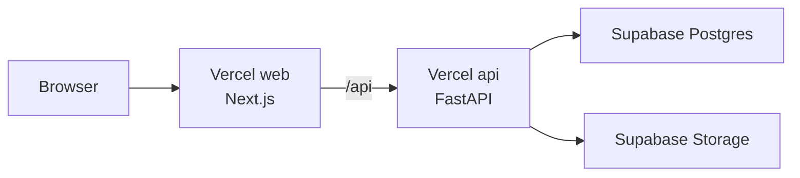

# Jerumi Build & Deployment Guide

이 문서는 Jerumi의 로컬 실행, 검증, Vercel Services와 Supabase 배포를 관리하는 canonical 문서입니다.

## 배포 아키텍처



Vercel Services의 `web` 서비스가 사용자 화면과 브라우저 전처리를 담당하고, `api` 서비스가 분석·추천·관리 API를 제공합니다. 제품 데이터는 Postgres에, 스와치 이미지는 Storage에 저장합니다.

## 요구 환경

- Node.js 20 LTS 이상과 npm
- Python 3.11
- Docker Desktop과 Docker Compose(통합 로컬 실행 시)
- Vercel 및 Supabase 프로젝트(프로덕션 배포 시)

## 로컬 실행

### Docker Compose

저장소 루트에서 전체 서비스를 실행합니다.

```bash
docker compose up --build
```

- Web: http://localhost:3000
- API: http://localhost:8000
- PostgreSQL: localhost:5432

개발용 기본 계정과 데이터베이스 값은 로컬 Compose 환경에서만 사용하고 운영 환경에 재사용하지 않습니다.

### 개별 실행

Backend:

```bash
python3 -m venv .venv
source .venv/bin/activate
python3 -m pip install -r backend/requirements-dev.txt
cd backend
uvicorn app.main:app --host 0.0.0.0 --port 8000 --reload
```

Frontend:

```bash
cd frontend
npm ci
NEXT_PUBLIC_API_URL=http://localhost:8000 npm run dev
```

개별 실행 전 PostgreSQL과 백엔드 환경 변수를 준비해야 합니다.

## 환경 변수

루트의 `.env.example`을 기준으로 설정합니다.

| 변수 | 공개 범위 | 설명 |
| --- | --- | --- |
| `DATABASE_URL` | Server only | PostgreSQL 연결 문자열 |
| `DATABASE_CONNECT_TIMEOUT` | Server only | 데이터베이스 연결 제한 시간 |
| `AUTO_CREATE_TABLES` | Server only | 시작 시 테이블 자동 생성 여부 |
| `JWT_SECRET` | Secret | 관리자 인증 토큰 서명 키 |
| `ADMIN_USERNAME` | Secret | 관리자 계정 이름 |
| `ADMIN_PASSWORD` | Secret | 관리자 계정 비밀번호 |
| `SUPABASE_URL` | Server only | Supabase 프로젝트 URL |
| `SUPABASE_SERVICE_ROLE_KEY` | Secret | Storage 관리용 service role key |
| `SUPABASE_STORAGE_BUCKET` | Server only | 파운데이션 이미지 버킷 |
| `CORS_ORIGINS` | Server only | 허용할 브라우저 출처 목록 |
| `CORS_ORIGIN_REGEX` | Server only | Preview 도메인용 선택적 정규식 |
| `NEXT_PUBLIC_API_URL` | Browser | 프론트엔드와 API를 분리 실행할 때의 API 주소 |

`SUPABASE_SERVICE_ROLE_KEY`, `JWT_SECRET`, 관리자 계정 값은 브라우저 번들이나 Git 기록에 넣지 않습니다. 운영 환경에서는 `AUTO_CREATE_TABLES=false`를 유지하고 마이그레이션을 별도로 관리합니다.

## 검증과 빌드

Frontend:

```bash
cd frontend
npm ci
npx tsc --noEmit
npm run build
```

Backend:

```bash
python3 -m pip install -r backend/requirements-dev.txt
python3 -m pytest backend/tests
```

Docker 통합 경로까지 확인할 때는 `docker compose up --build` 후 Web과 API health endpoint를 함께 점검합니다.

## Vercel Services 설정

- Root Directory: 저장소 루트
- Framework Preset: Services
- 설정 파일: [vercel.json](../vercel.json)
- `web`: `frontend`를 `/`에 배포
- `api`: `backend/main.py`를 `/api`에 배포
- API 최대 실행 시간: 60초

Vercel Git integration을 연결하면 `main` 브랜치가 Production을 갱신합니다. 프론트엔드와 API를 같은 origin에서 서비스하므로 Production에서는 `NEXT_PUBLIC_API_URL`을 비워 상대 `/api` 경로를 사용합니다.

## Supabase 설정

### Postgres

- `DATABASE_URL`에는 Supabase Postgres 연결 문자열을 설정합니다.
- Session pooler와 TLS 연결을 권장합니다.
- 운영 배포 전 필요한 테이블과 스키마를 준비합니다.

### Storage

1. 파운데이션 스와치용 public bucket을 생성합니다.
2. bucket 이름을 `SUPABASE_STORAGE_BUCKET`에 설정합니다.
3. FastAPI만 service role key를 사용해 업로드와 삭제를 수행합니다.
4. 브라우저에는 public image URL만 반환합니다.

## 배포 후 점검

1. `GET /api/health`가 성공하는지 확인합니다.
2. `/scan`에서 이미지 업로드와 `/api/analyze` 요청을 확인합니다.
3. 관리자 로그인과 foundation CRUD를 확인합니다.
4. 사진 기반 등록 후 `swatch_image_url`이 올바른 Storage URL인지 확인합니다.
5. 항목 삭제 시 연결된 Storage object도 정리되는지 확인합니다.
6. Vercel Analytics와 Speed Insights가 Production에서 수집되는지 확인합니다.

## 운영 제약과 장애 대응

- 분석 품질은 촬영 조건과 입력 이미지에 영향을 받습니다.
- 데이터베이스 연결 실패 시 Supabase URL, pooler 모드, TLS query를 먼저 확인합니다.
- Storage 오류는 bucket 이름의 보이지 않는 문자, bucket 공개 설정과 service role key를 확인합니다.
- API cold start가 길면 운영 의존성과 `AUTO_CREATE_TABLES` 설정을 점검합니다.
- 문제가 있는 배포는 Vercel의 이전 정상 배포를 Production으로 승격해 롤백합니다.
