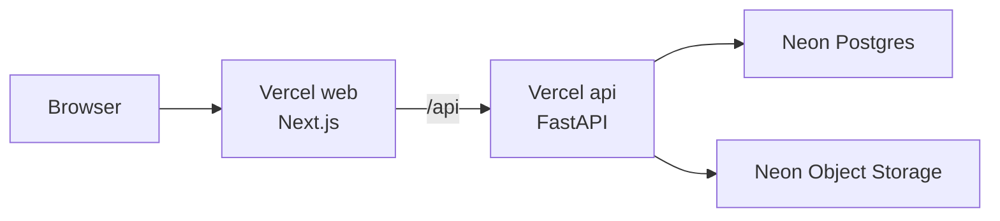

# Jerumi Build & Deployment Guide

이 문서는 Jerumi의 로컬 실행, 검증, Vercel Services와 Neon 배포를 관리하는 canonical 문서입니다.

## 배포 아키텍처


```mermaid
flowchart LR
    A["Browser"] --> B["Vercel web<br/>Next.js"]
    B -->|/api| C["Vercel api<br/>FastAPI"]
    C --> D["Neon Postgres"]
    C --> E["Neon Object Storage"]
```

Vercel Services의 `web` 서비스가 사용자 화면과 브라우저 전처리를 담당하고, `api` 서비스가 분석·추천·관리 API를 제공합니다. 제품 데이터는 Postgres에, 스와치 이미지는 Storage에 저장합니다.

## 요구 환경

- Node.js 20 LTS 이상과 npm
- Python 3.11 이상
- Docker Desktop과 Docker Compose(통합 로컬 실행 시)
- Vercel 및 Neon 프로젝트(프로덕션 배포 시)

## 로컬 실행

### Docker Compose

저장소 루트에서 전체 서비스를 실행합니다.

```bash
docker compose up --build
```

- Web: http://localhost:3000
- API: http://localhost:8000
- PostgreSQL: localhost:5432

개발용 기본 계정과 데이터베이스 값은 로컬 Compose 환경에서만 사용하고 운영 환경에 재사용하지 않습니다.

### 개별 실행

Backend:

```bash
python3 -m venv .venv
source .venv/bin/activate
python3 -m pip install -r backend/requirements-dev.txt
cd backend
uvicorn app.main:app --host 0.0.0.0 --port 8000 --reload
```

Frontend:

```bash
cd frontend
npm ci
NEXT_PUBLIC_API_URL=http://localhost:8000 npm run dev
```

개별 실행 전 PostgreSQL과 백엔드 환경 변수를 준비해야 합니다.

## 환경 변수

루트의 `.env.example`을 기준으로 설정합니다.

| 변수 | 공개 범위 | 설명 |
| --- | --- | --- |
| `DATABASE_URL` | Server only | PostgreSQL 연결 문자열 |
| `DATABASE_CONNECT_TIMEOUT` | Server only | 데이터베이스 연결 제한 시간 |
| `AUTO_CREATE_TABLES` | Server only | 시작 시 테이블 자동 생성 여부 |
| `JWT_SECRET` | Secret | 관리자 인증 토큰 서명 키 |
| `ADMIN_USERNAME` | Secret | 관리자 계정 이름 |
| `ADMIN_PASSWORD` | Secret | 관리자 계정 비밀번호 |
| `AWS_ENDPOINT_URL_S3` | Server only | Neon 브랜치의 Object Storage S3 endpoint |
| `AWS_ACCESS_KEY_ID` | Server only | Neon storage credential의 `token_id` |
| `AWS_SECRET_ACCESS_KEY` | Secret | Neon storage credential의 `s3_secret_access_key` |
| `AWS_REGION` | Server only | Object Storage region (예: `ap-southeast-1`) |
| `STORAGE_BUCKET` | Server only | 파운데이션 이미지 버킷 |
| `CORS_ORIGINS` | Server only | 허용할 브라우저 출처 목록 |
| `CORS_ORIGIN_REGEX` | Server only | Preview 도메인용 선택적 정규식 |
| `NEXT_PUBLIC_API_URL` | Browser | 프론트엔드와 API를 분리 실행할 때의 API 주소 |

`AWS_SECRET_ACCESS_KEY`, `JWT_SECRET`, 관리자 계정 값은 브라우저 번들이나 Git 기록에 넣지 않습니다. 운영 환경에서는 `AUTO_CREATE_TABLES=false`를 유지하고 마이그레이션을 별도로 관리합니다.

## 검증과 빌드

Frontend:

```bash
cd frontend
npm ci
npx tsc --noEmit
npm run build
```

Backend:

```bash
python3 -m pip install -r backend/requirements-dev.txt
python3 -m pytest backend/tests
```

FastAPI 계약을 변경한 경우 OpenAPI snapshot과 프론트 타입을 함께 갱신합니다.

```bash
PYTHONPATH=backend backend/.venv/bin/python \
  backend/scripts/export_openapi.py backend/openapi.json
cd frontend
npm run generate:api-types
```

`backend/openapi.json`이 FastAPI 스키마와 다르면 백엔드 테스트가 실패합니다.
프론트 API 타입은 `src/types/api.generated.ts`에서 직접 수정하지 않습니다.

Docker 통합 경로까지 확인할 때는 `docker compose up --build` 후 Web과 API health endpoint를 함께 점검합니다.

## Vercel Services 설정

- Root Directory: 저장소 루트
- Framework Preset: Services
- 설정 파일: [vercel.json](../vercel.json)
- `web`: `frontend`를 `/`에 배포
- `api`: `backend/main.py`를 `/api`에 배포
- API 최대 실행 시간: 60초

Vercel Git integration을 연결하면 `main` 브랜치가 Production을 갱신하고,
그 외 브랜치는 Preview deployment를 생성합니다. 프론트엔드와 API를 같은
origin에서 서비스하므로 Vercel Services에서는 `NEXT_PUBLIC_API_URL`을 비워
상대 `/api` 경로를 사용합니다. 별도 API를 연결할 때만 절대 URL을 설정하며,
앞뒤 공백과 마지막 `/`는 프론트 API 모듈이 정규화합니다.

### 리팩터링 Preview

1. `refactor/jerumi-safety-net` 브랜치를 push하고 Draft PR을 엽니다.
2. DB 변경 전 단계는 Vercel Preview에서 빌드와 읽기 경로만 확인합니다.
3. DB·Storage 변경 단계는 운영 `main`이 아닌 Neon 자식 브랜치를 만들고, 그
   브랜치의 환경 변수를 해당 Git 브랜치의 Preview 환경에만 설정합니다. 자식
   브랜치는 DB와 bucket을 copy-on-write로 상속하므로 운영 데이터에 영향이 없습니다.
4. `DATABASE_URL`, `AWS_ENDPOINT_URL_S3`, storage credential, `STORAGE_BUCKET`,
   관리자 비밀값을 모두 같은 브랜치로 맞춥니다.
5. Preview 승인 전에는 main에 병합하지 않습니다.

## Neon 설정

### Postgres

- `DATABASE_URL`에는 Neon의 pooled 연결 문자열(`-pooler` 호스트)을 설정합니다.
  Neon이 주는 `postgresql://...?sslmode=require&channel_binding=require` 형식을
  그대로 넣어도 backend가 asyncpg용으로 정규화합니다(`sslmode`→`ssl`,
  `channel_binding` 제거).
- `db/migrations/`가 테이블과 인덱스 정의를 가집니다. 새 브랜치나 프로젝트에는
  번호 순서대로 적용합니다.

  ```bash
  psql "$DATABASE_URL" -f db/migrations/0001_baseline_foundations_and_storage_cleanup.sql
  ```

- API만 DB 소유자 role로 접속하며, Data API는 사용하지 않습니다.
- Neon compute는 유휴 시 scale-to-zero 되었다가 첫 요청에 자동으로 깨어나므로
  별도의 keepalive 작업이 필요 없습니다.

### Object Storage

1. Neon Console의 **Object storage** 탭(또는 `neon buckets create
   foundation-swatches --access-level public_read`)으로 `foundation-swatches`
   bucket을 `public_read`로 만듭니다.
2. `storage:read`, `storage:write` scope의 credential을 발급해
   `AWS_ACCESS_KEY_ID`(token_id)와 `AWS_SECRET_ACCESS_KEY`로 설정합니다.
   비밀값은 발급 시 한 번만 표시됩니다.
3. FastAPI만 credential을 사용해 S3 API로 업로드와 삭제를 수행합니다.
4. 브라우저에는 `{AWS_ENDPOINT_URL_S3}/{bucket}/{key}` 형식의 공개 URL만 반환합니다.
5. DB 삭제 트랜잭션은 `storage_cleanup_jobs` outbox를 함께 기록합니다. Storage
   삭제 실패는 `POST /api/foundations/storage-cleanups/retry`로 멱등 재시도합니다.

## 배포 후 점검

1. `GET /api/health`가 성공하는지 확인합니다.
2. `/scan`에서 이미지 업로드와 `/api/analyze` 요청을 확인합니다.
3. 관리자 로그인과 foundation CRUD를 확인합니다.
4. 사진 기반 등록 후 `swatch_image_url`이 올바른 Storage URL인지 확인합니다.
5. 항목 삭제 시 연결된 Storage object가 정리되고 pending cleanup job이 없는지
   확인합니다. 강제로 Storage 실패를 만들었다면 재시도 API가 작업을 완료해야
   합니다.
6. Vercel Analytics와 Speed Insights가 Production에서 수집되는지 확인합니다.

## 운영 제약과 장애 대응

- 분석 품질은 촬영 조건과 입력 이미지에 영향을 받습니다.
- 데이터베이스 연결 실패 시 Neon 연결 문자열, pooler 호스트, TLS query를 먼저 확인합니다.
- Storage 오류는 bucket 이름의 보이지 않는 문자, bucket 접근 수준(`public_read`), credential scope와 브랜치 계보를 확인합니다.
- API cold start가 길면 운영 의존성과 `AUTO_CREATE_TABLES` 설정을 점검합니다.
- 문제가 있는 배포는 Vercel의 이전 정상 배포를 Production으로 승격해 롤백합니다.
